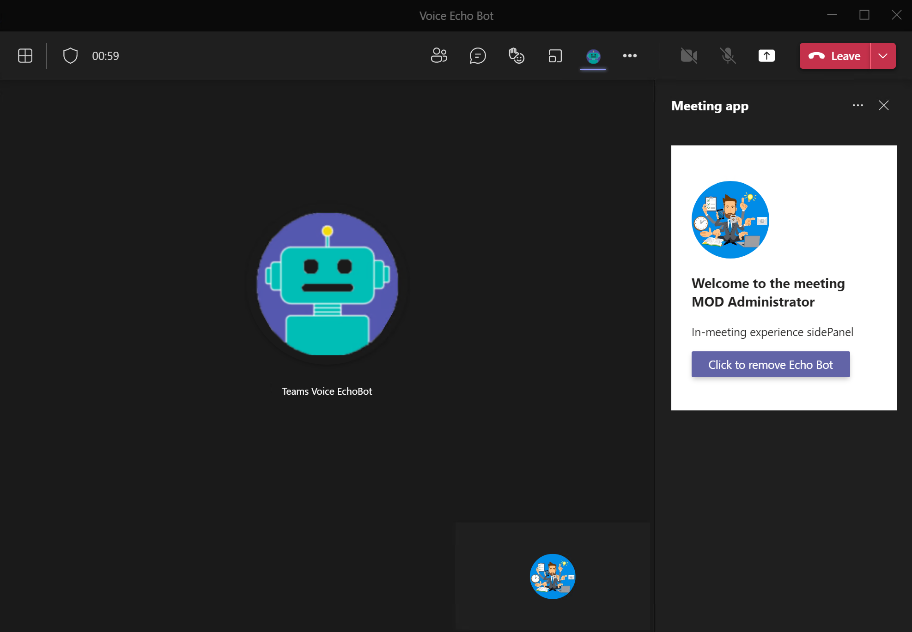

> **Note:**  
> Please be advised that this sample repository is built on projects that are either in **Public Preview** or **provided by developers from the Microsoft Graph community** - Please review the GitHub documentation of these underlying projects to get the latest updates. 

# Voice Echo Bot - A Microsoft Teams meeting application

This application demonstrates how to create a bot that responds to voice commands from a Microsoft Teams meeting. It provides the building blocks to create your own personnal or enterprise **"Teams Meeting Virtual Assistant"**.

Once joined to the meeting, the Voice Echo Bot will repeat the latest sentence pronounced. This sample has been built to demonstrate the following capabilities:

- How to attach an audio recording bot that listens, processes (speech-to-text and text-to-speech) and returns a response as an audio stream
- How to ask the bot to join and leave the call on-demand from a Teams in-meeting application

This demonstrator is built upon the following developments and code samples:
- The Teams **Voice Echo Bot** developed by the Microsoft Graph  community - [microsoft-graph-comms-samples - EchoBot
](https://github.com/microsoftgraph/microsoft-graph-comms-samples/tree/master/Samples/PublicSamples/EchoBot)
- The Teams **in-meeting-app** code sample provided by the  TeamsFx community - [TeamsFx-Samples - in-meeting-app](https://github.com/OfficeDev/TeamsFx-Samples/tree/v2/in-meeting-app)

You can expand the capabilities of this demonstrator using Microsoft Cognitive Services like LUIS (language understanding) to detect the user's intents and trigger actions like:
- "Create a task" using To Do API
- "Schedule a meeting with Paul" using Outlook API
- "What is the sales number for June?" using PowerBI API
- "Ask Peter to join the call" using Teams Graph API
- and so on and so worth...

## What you will learn with this sample
- How to build a Teams meeting App that uses tab & bot capabilities. 
- How to build a Bot that access the I/O audio streams in a Teams meeting app. 
- How to use Microsoft Teams SDK to get Teams user login information. 
- How to use Microsoft Graph to get access to user profile data. 
- How to use the Teams Toolkit to provision and deploy your app to Azure. 

## Prerequisites
-  [NodeJS](https://nodejs.org/en/)
-  [ngrok](https://ngrok.com/)
-  An M365 account, if you do not have M365 account, apply one from [M365 developer program](https://developer.microsoft.com/en-us/microsoft-365/dev-program)
-  [Teams Toolkit Visual Studio Code Extension](https://aka.ms/teams-toolkit)
-  An [Azure subscription](https://azure.microsoft.com/en-us/free/)
- You need to be an admin of your Azure AD tenant to grant application level permissions

## Try this sample
### Step 1: Deploy the Teams Voice Echo Bot
All the setps and instructions to deploy the Voice Echo Bot are documented on this [GitHub page](https://github.com/microsoftgraph/microsoft-graph-comms-samples/tree/master/Samples/PublicSamples/EchoBot)  
Once the deployment is done, you'll need to save the endpoint of your Voice Echo Bot. The endpoint will be similar to https://bot.example.com/joinCall where bot.example.com is the URL where the bot is deployed - This value will used to set the **VOICE_ECHO_BOT_URL** parameter in the next steps.

> Note: we recommend that you test your Voice Echo Bot and verify that you successfully pass the test described in "Running the Sample" before moving to the next step - You should have your Voice Echo Bot able to connect to a meeting using its joinURL.

### Step 2: Configure the Teams in-meeting application
All the setps and instructions to deploy the Voice Echo Bot are documented [here](./README-In-meeting-App.md)

- Step 2.1: Start ngrok
- Step 2.2: Complete Bot Registration in Azure (you can reuse the app regitered in Step 1)
- Step 2.3: Register Azure Active Directory applications
- Step 2.4: Update placeholders in manifest file 
- Step 2.5: Build and run the app
- Step 2.6: Use the app in Teams

## Code of Conduct
This project has adopted the [Microsoft Open Source Code of Conduct](https://opensource.microsoft.com/codeofconduct/).

For more information see the [Code of Conduct FAQ](https://opensource.microsoft.com/codeofconduct/faq/) or
contact [opencode@microsoft.com](mailto:opencode@microsoft.com) with any additional questions or comments.

## Contributing

This project welcomes contributions and suggestions.  Most contributions require you to agree to a
Contributor License Agreement (CLA) declaring that you have the right to, and actually do, grant us
the rights to use your contribution. For details, visit https://cla.opensource.microsoft.com.

When you submit a pull request, a CLA bot will automatically determine whether you need to provide
a CLA and decorate the PR appropriately (e.g., status check, comment). Simply follow the instructions
provided by the bot. You will only need to do this once across all repos using our CLA.

This project has adopted the [Microsoft Open Source Code of Conduct](https://opensource.microsoft.com/codeofconduct/).
For more information see the [Code of Conduct FAQ](https://opensource.microsoft.com/codeofconduct/faq/) or
contact [opencode@microsoft.com](mailto:opencode@microsoft.com) with any additional questions or comments.

## Trademarks

This project may contain trademarks or logos for projects, products, or services. Authorized use of Microsoft
trademarks or logos is subject to and must follow
[Microsoft's Trademark & Brand Guidelines](https://www.microsoft.com/en-us/legal/intellectualproperty/trademarks/usage/general).
Use of Microsoft trademarks or logos in modified versions of this project must not cause confusion or imply Microsoft sponsorship.
Any use of third-party trademarks or logos are subject to those third-party's policies.